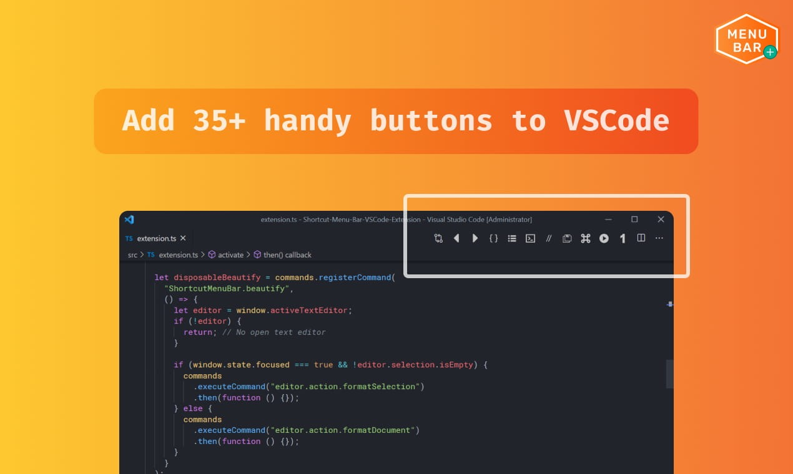

# Shortcut Menu Bar Plus - VSCode Extension

Add 35+ handy buttons like beautify, show opened files, save, toggle terminal, activity bar, Find replace etc to the editor menu bar in VSCode. You can also create your own buttons with custom commands.

[Forked](https://github.com/GorvGoyl/Shortcut-Menu-Bar-VSCode-Extension) from the great work of [Gourav Goyal](https://gourav.io)

#### [See on VSCode Marketplace](https://marketplace.visualstudio.com/items?itemName=snuffy2.shortcut-menu-bar-plus)

## 📷 Screenshot

## ⚙ Enable/Disable buttons from VSCode settings

Go to VSCode settings (`CTRL+,` or `CMD+,`) and search for `shortcut menu bar`. Toggle buttons from there.

## ✅ Currently added buttons

✔ Save active file  
✔ Navigate back  
✔ Navigate forward  
✔ Beautify/format document or selection  
✔ Beautify/format document or selection with multiple formatters  
✔ Undo/Redo buttons  
✔ Open files list  
✔ Save all  
✔ show/hide terminal  
✔ show/hide render whitespace  
✔ Quick open (Ctrl+P)  
✔ show/hide activity bar  
✔ Find & replace in active file (Ctrl+H)  
✔ Switch header source (for .cpp files)  
✔ Toggle line comment  
✔ Open file, New file  
✔ Go to definition  
✔ Cut, Copy, Paste  
✔ Start Debugging  
✔ User-defined buttons (0-9)

## Create buttons with custom commands

You can create upto 10 user-defined buttons.  
Buttons will be shown as numbers as shown in below image.

> Note: To add custom icons for commands, see this [hack](https://github.com/GorvGoyl/Shortcut-Menu-Bar-VSCode-Extension/issues/58#issuecomment-918663851).

You can also trigger a button by using corresponding hotkey combination (Windows: `Ctrl+Alt+0`, `Ctrl+Alt+1`, `Ctrl+Alt+2`, etc, Mac: `Shift+Cmd+0`, `Shift+Cmd+1`, `Shift+Cmd+2`, etc)

1. Got to extension settings (`Ctrl+,` or `Cmd+,`).
2. Look for `Shortcut Menu Bar Plus: User Button`
3. Add any [VSCode command](https://code.visualstudio.com/docs/getstarted/keybindings#_default-keyboard-shortcuts) or any other extension command in the input field. Button icon will be visible only when you add a command.

   

Optionally, you can also:

- Pass command arguments: add command arguments separated by pipe (e.g. `workbench.action.tasks.runTask|My Task`)
- Run multiple commands: add comma-separated list of commands and those will get executed sequentially.

### FAQ 🙋‍

**I found a bug, where to report?**  
Please create a [new issue on Github](https://github.com/Snuffy2/Shortcut-Menu-Bar-Plus-VSCode-Extension/issues).

**How can I add my own/custom buttons?**  
Follow above [section](#create-buttons-with-custom-commands).

**Can I contribute new buttons to the extension repo?**  
Sure. To add buttons see ["Adding new buttons" section of `help.md` file in repo](help.md#adding-new-buttons).  
Go through the [repo](https://github.com/Snuffy2/Shortcut-Menu-Bar-Plus-VSCode-Extension/), it's fairly simple to understand code and add a button. Send me a PR!

**How can I disable/Enable a button?**  
Follow above [section](#-enabledisable-buttons-from-vscode-settings).
