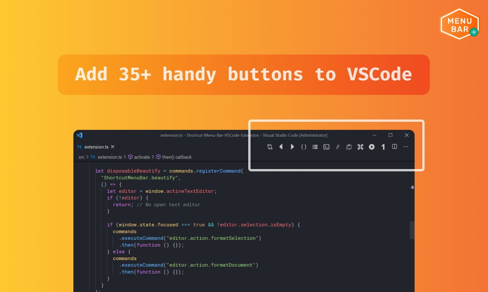

# Shortcut Menu Bar Plus - VSCode Extension

Add 35+ handy buttons like beautify, show opened files, save, toggle terminal, activity bar, Find replace etc to the editor menu bar in VSCode. You can manage the toolbar from a graphical configurator, reorder built-in buttons, and create your own buttons with custom commands, names, and icons.

[Forked](https://github.com/GorvGoyl/Shortcut-Menu-Bar-VSCode-Extension) from the great work of [Gourav Goyal](https://gourav.io)

#### [See on VSCode Marketplace](https://marketplace.visualstudio.com/items?itemName=snuffy2.shortcut-menu-bar-plus)

## What's new in 3.2.0

- A new `Shortcut Menu Bar Plus: Configure Buttons` command manages the full toolbar from one screen.
- Built-in buttons can be enabled, disabled, and reordered with drag and drop.
- The 10 user buttons can now be configured with command strings, display labels, and Codicon icons.
- User-button icons are generated in dark and light variants so they match VS Code themes.
- Toolbar order, visibility, user-button titles, and user-button icons are restored on startup after reloads or extension updates.
- Existing legacy settings still work and are migrated into the configurator model when no structured configuration exists.

## Configure buttons

Run `Shortcut Menu Bar Plus: Configure Buttons` from the Command Palette to manage the toolbar.

The configurator lets you:

- Enable or disable built-in and user buttons.
- Rearrange all toolbar buttons in one ordered list with drag and drop.
- Edit commands, labels, and codicons for the 10 user buttons.
- Pick user-button codicons from a searchable picker with icon previews instead of typing setting values by hand.
- Save from either the top or bottom of the configurator and reload from the same screen when toolbar metadata changes require it.

After saving toolbar visibility, order, label, or icon changes, reload VS Code when prompted. VS Code applies editor title menu contributions during window load, so these toolbar changes are not visible until after reload. Command-only edits do not require a reload.

Configurator changes are saved globally because VS Code loads toolbar command contributions from the installed extension package. The backing setting is `ShortcutMenuBarPlus.buttons`; it is intended to be written by the configurator, not edited by hand.

Maintainer note: the Codicon enum in `package.json` is duplicated across every `ShortcutMenuBarPlus.userButtonXXIcon` setting. Keep those enum lists in sync whenever adding or removing supported Codicons.

## ✅ Currently added buttons

✔ Save active file  
✔ Navigate back  
✔ Navigate forward  
✔ Beautify/format document or selection  
✔ Beautify/format document or selection with multiple formatters  
✔ Undo/Redo buttons  
✔ Open files list  
✔ Save all  
✔ show/hide terminal  
✔ show/hide render whitespace  
✔ Quick open (Ctrl+P)  
✔ show/hide activity bar  
✔ Find & replace in active file (Ctrl+H)  
✔ Switch header source (for .cpp files)  
✔ Toggle line comment  
✔ Open file, New file  
✔ Go to definition  
✔ Cut, Copy, Paste  
✔ Start Debugging  
✔ User-defined buttons (0-9)

## Create buttons with custom commands

You can create up to 10 user-defined buttons in `Shortcut Menu Bar Plus: Configure Buttons`.
By default buttons are shown as numbers, and the configurator can set each button's label and icon.

You can also trigger a button by using corresponding hotkey combination (Windows: `Ctrl+Alt+0`, `Ctrl+Alt+1`, `Ctrl+Alt+2`, etc, Mac: `Shift+Cmd+0`, `Shift+Cmd+1`, `Shift+Cmd+2`, etc)

1. Run `Shortcut Menu Bar Plus: Configure Buttons`.
2. Enable one of the user buttons.
3. Add any [VSCode command](https://code.visualstudio.com/docs/getstarted/keybindings#_default-keyboard-shortcuts) or any other extension command in the command field.
4. Optionally set a label and codicon.
5. Save, then reload VS Code if prompted.

User buttons also support:

- Pass command arguments: add command arguments separated by pipe (e.g. `workbench.action.tasks.runTask|My Task`)
- Run multiple commands: add comma-separated list of commands and those will get executed sequentially.
- If the label is empty, default labels are used (`user action 1` ... `user action 9`, `user action 0`).
- If the icon is empty, the default numbered user-button icon is used.

Legacy per-user-button settings remain available for compatibility, but the configurator is the primary way to manage buttons. Once `ShortcutMenuBarPlus.buttons` exists globally, it takes precedence over the older per-button settings.

### FAQ 🙋‍

**I found a bug, where to report?**  
Please create a [new issue on GitHub](https://github.com/Snuffy2/shortcut-menu-bar-plus/issues).

**How can I add my own/custom buttons?**  
Follow above [section](#create-buttons-with-custom-commands).

**Can I contribute new buttons to the extension repo?**  
Sure. To add buttons see ["Adding new buttons" section of `help.md` file in repo](https://github.com/Snuffy2/shortcut-menu-bar-plus/blob/main/help.md#adding-new-buttons). Go through the [repo](https://github.com/Snuffy2/shortcut-menu-bar-plus), it's fairly simple to understand code and add a button. Send me a PR!

**How can I disable/Enable a button?**  
Follow above [section](#configure-buttons).
